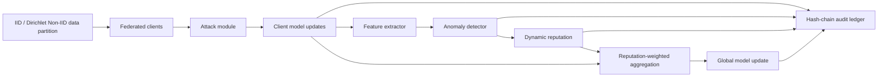

# TrustFL-Chain System Design

## Architecture



## Modules

- **Federated learning:** single-machine simulation with multiple clients, IID or Dirichlet Non-IID partitions, local SGD, and server aggregation.
- **Attacks:** label flipping during local training; sign flipping, Gaussian noise, and model scaling on uploaded updates.
- **Anomaly detection:** extracts update norm, cosine similarity to the mean update, distance to the coordinate median, temporal deviation, and current reputation.
- **Dynamic reputation:** initializes each client at 1.0, applies multiplicative penalties to risky updates, and slowly recovers honest-looking clients.
- **Ledger:** records hashes and scalar audit metadata in `results/ledger.jsonl`; full model parameters are not stored in the ledger.

## Threat Model

The adversary controls a fraction of clients and can manipulate local labels or uploaded updates. The server is trusted to run aggregation, detection, and ledger recording. The prototype does not address secure aggregation, privacy leakage, Sybil attacks, adaptive white-box attackers, or production blockchain consensus.

## Core Algorithm

1. Initialize global model, client partitions, client reputations, and ledger state.
2. Sample participating clients each round.
3. Clients train locally and malicious clients apply the configured attack.
4. Server extracts update-level features.
5. Detector assigns risk scores.
6. Reputation manager penalizes high-risk clients and recovers low-risk clients.
7. Server aggregates updates using the selected baseline or reputation-weighted TrustFL-Chain.
8. Ledger appends update hashes, risks, reputations, aggregation hash, and previous block hash.
9. Metrics are written to CSV.

## Pseudocode

```text
for round t = 1..T:
    S_t <- sample clients
    for client i in S_t:
        delta_i <- LocalTrain(w_t, D_i)
        if i is malicious:
            delta_i <- Attack(delta_i)
    z_i <- ExtractFeatures(delta_i, history_i, reputation_i)
    risk_i <- AnomalyDetector(z_i)
    reputation_i <- UpdateReputation(reputation_i, risk_i)
    w_{t+1} <- Aggregate({delta_i}, weights={reputation_i})
    LedgerAppend(hash(delta_i), risk_i, reputation_i, hash(w_{t+1}))
```

## Experiment Plan

- **Sanity check:** Fashion-MNIST or synthetic fallback, 20 clients, 10 sampled clients, 3-5 rounds.
- **Core study:** Fashion-MNIST and CIFAR-10, malicious ratios 0.1-0.4, attacks label flipping/sign flipping/noise/scaling.
- **Baselines:** FedAvg, median, trimmed mean, Krum, cosine filtering, TrustFL-Chain.
- **Ablations:** no reputation, no temporal feature, cosine-only detection, no ledger, dynamic recovery vs static penalty.
- **Metrics:** accuracy, detection precision/recall/F1/FPR, runtime per round, ledger bytes, and reputation evolution.
